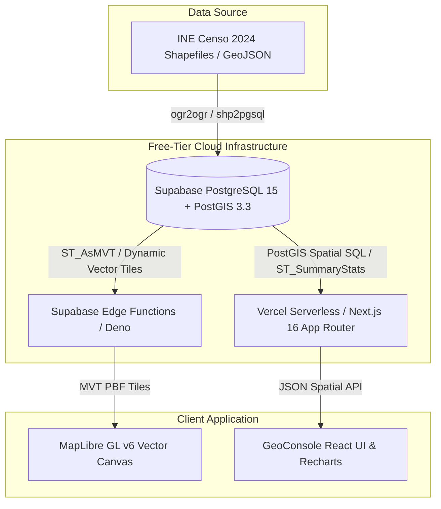

# Enterprise PostGIS Cloud Architecture & Deployment Plan (Free-Tier Stack)

This document presents a production-grade, zero-cost architecture blueprint for transitioning the **GeoInsights Bolivia** spatial dataset from static PMTiles to a live, cloud-native **PostGIS + Vector Tile Server** pipeline using free-tier services (**Supabase PostGIS**, **Martin / pg_tileserv**, **Vercel**, and **MapLibre GL**).

---

## 1. High-Level System Architecture



---

## 2. Technology Stack & Free-Tier Limits

| Component | Free-Tier Provider | Free Plan Specifications & Limits | Cost |
|---|---|---|---|
| **Database & Spatial Engine** | **Supabase (PostgreSQL 15 + PostGIS 3.3)** | 500 MB database storage, 2 GB bandwidth, full PostGIS extension support (`CREATE EXTENSION postgis;`), 50,000 monthly active users. | **$0 / month** |
| **Vector Tile Server / Middleware** | **Supabase Edge Functions (Deno)** or **Martin on Render/Koyeb** | 500,000 Edge Function invocations/month, 2 GB egress. Executes dynamic `ST_AsMVT` queries. | **$0 / month** |
| **Application & API Server** | **Vercel Hobby Plan** | 100 GB bandwidth, unlimited Serverless Function executions for Next.js App Router API routes (`/api/spatial`). | **$0 / month** |
| **Map Engine & Tile Renderer** | **MapLibre GL v6** | Open-source client-side WebGL renderer; no tile view limits or commercial API keys required. | **$0 / month** |

---

## 3. Database Schema & PostGIS Optimization

### 3.1 Spatial Table Structure (`ine_manzanos_2024`)

```sql
-- Enable PostGIS spatial extension in Supabase
CREATE EXTENSION IF NOT EXISTS postgis;
CREATE EXTENSION IF NOT EXISTS postgis_topology;

-- Create census block table
CREATE TABLE public.ine_manzanos_2024 (
    id BIGSERIAL PRIMARY KEY,
    cod_manzano VARCHAR(32) NOT NULL UNIQUE,
    departamento VARCHAR(64) NOT NULL,
    municipio VARCHAR(64) NOT NULL,
    zona_urbana VARCHAR(128),
    poblacion_total INT DEFAULT 0,
    densidad_hab_ha NUMERIC(10,2) DEFAULT 0.00,
    pct_internet NUMERIC(5,2) DEFAULT 0.00,
    pct_agua_caneria NUMERIC(5,2) DEFAULT 0.00,
    pct_alcantarillado NUMERIC(5,2) DEFAULT 0.00,
    pct_educacion_superior NUMERIC(5,2) DEFAULT 0.00,
    geom GEOMETRY(MultiPolygon, 4326) NOT NULL
);

-- Spatial GIST Index for high-speed bounding-box queries
CREATE INDEX idx_ine_manzanos_geom ON public.ine_manzanos_2024 USING GIST (geom);

-- BTree Indexes for fast city/department filtering
CREATE INDEX idx_ine_manzanos_dept ON public.ine_manzanos_2024 (departamento);
CREATE INDEX idx_ine_manzanos_muni ON public.ine_manzanos_2024 (municipio);
```

### 3.2 Dynamic Vector Tile Generation Query (`ST_AsMVT`)

This function generates Mapbox Vector Tiles (`MVT / pbf`) directly inside PostGIS for any bounding box `(z, x, y)` requested by MapLibre GL:

```sql
CREATE OR REPLACE FUNCTION public.mvt_manzanos(z integer, x integer, y integer)
RETURNS bytea AS $$
DECLARE
    bbox geometry;
    tile bytea;
BEGIN
    -- Convert tile coordinates (z, x, y) to Web Mercator bounding box
    bbox := ST_TileEnvelope(z, x, y);

    SELECT ST_AsMVT(mvtgeom, 'manzanos', 4096, 'geom')
    INTO tile
    FROM (
        SELECT
            id,
            cod_manzano,
            zona_urbana,
            poblacion_total AS a1,
            densidad_hab_ha AS b1,
            pct_internet AS v1,
            pct_agua_caneria AS r1,
            pct_educacion_superior AS g1,
            ST_AsMVTGeom(
                ST_Transform(geom, 3857),
                bbox,
                4096,
                256,
                true
            ) AS geom
        FROM public.ine_manzanos_2024
        WHERE ST_Transform(geom, 3857) && bbox
    ) AS mvtgeom;

    RETURN tile;
END;
$$ LANGUAGE plpgsql STABLE PARALLEL SAFE;
```

---

## 4. Live Serverless API Endpoints

### 4.1 Supabase Edge Function (`/functions/v1/mvt-server`)

Serves MVT vector tiles dynamically with HTTP caching headers:

```typescript
// Supabase Edge Function (Deno)
import { serve } from "https://deno.land/std@0.168.0/http/server.ts";
import { createClient } from "https://esm.sh/@supabase/supabase-js@2";

const supabase = createClient(
  Deno.env.get("SUPABASE_URL")!,
  Deno.env.get("SUPABASE_SERVICE_ROLE_KEY")!
);

serve(async (req) => {
  const url = new URL(req.url);
  const pathParts = url.pathname.split("/").filter(Boolean); // e.g. ["mvt", "8", "120", "200"]
  const [_, zStr, xStr, yStr] = pathParts;

  const z = parseInt(zStr, 10);
  const x = parseInt(xStr, 10);
  const y = parseInt(yStr, 10);

  const { data, error } = await supabase.rpc("mvt_manzanos", { z, x, y });

  if (error || !data) {
    return new Response(JSON.stringify({ error: error?.message }), { status: 400 });
  }

  return new Response(data, {
    headers: {
      "Content-Type": "application/x-protobuf",
      "Cache-Control": "public, max-age=86400, s-maxage=604800", // Cache tiles in browser & CDN
      "Access-Control-Allow-Origin": "*",
    },
  });
});
```

### 4.2 Spatial Viewport Aggregation API (`/api/spatial/stats`)

Performs real-time spatial SQL aggregations over any arbitrary bounding polygon:

```typescript
// Next.js App Router: app/api/spatial/stats/route.ts
import { NextResponse } from 'next/server';
import { createClient } from '@supabase/supabase-js';

const supabase = createClient(
  process.env.NEXT_PUBLIC_SUPABASE_URL!,
  process.env.SUPABASE_SERVICE_ROLE_KEY!
);

export async function POST(request: Request) {
  const { bbox } = await request.json(); // [minLng, minLat, maxLng, maxLat]

  const { data, error } = await supabase.rpc('get_viewport_analytics', {
    min_lng: bbox[0],
    min_lat: bbox[1],
    max_lng: bbox[2],
    max_lat: bbox[3],
  });

  if (error) {
    return NextResponse.json({ error: error.message }, { status: 500 });
  }

  return NextResponse.json(data);
}
```

---

## 5. Client Integration Plan with MapLibre GL

In `components/map/RealBlockMapWidget.client.tsx`, simply swap out the PMTiles URL with the Supabase PostGIS vector tile endpoint:

```typescript
// MapLibre GL Vector Source pointing to Supabase PostGIS
map.addSource('postgis-manzanos', {
  type: 'vector',
  tiles: ['https://YOUR_SUPABASE_PROJECT.supabase.co/functions/v1/mvt-server/{z}/{x}/{y}'],
  minzoom: 8,
  maxzoom: 14,
});
```

---

## 6. Migration Roadmap & Execution Steps

1. **Database Provisioning (Day 1):** Create free Supabase project, enable `postgis` extension, execute DDL schema script.
2. **ETL Data Loading (Day 1):** Use `ogr2ogr` to upload INE Censo 2024 shapefiles into Supabase PostGIS table `ine_manzanos_2024`.
3. **MVT Function Deployment (Day 2):** Deploy `mvt_manzanos` PL/pgSQL function and Supabase Edge Function tile server.
4. **Next.js API Integration (Day 2):** Wire `/api/spatial/stats` to run live PostGIS viewport SQL queries.
5. **Frontend Switch (Day 3):** Update `RealBlockMapWidget.client.tsx` to read from Supabase PostGIS while maintaining zero-downtime fallback to `atlas.pmtiles`.
